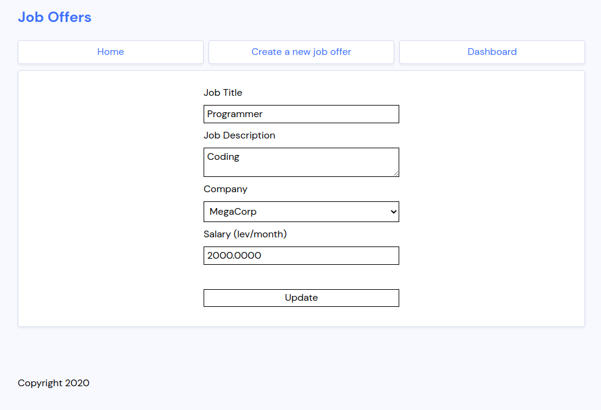

# devrix-job-board

The repository for my solution of DevriX's exam for their internship program.

It's an oversimplified job offer website, (roughly) following the MVC design pattern and using the LAMP stack (with MySQL).

**CREDENTIALS FOR DASHBOARD**
```
Username: admin
Password: admin
```

<details>
	<summary>Screenshorts of site</summary>
	
	
	
	
	
</details>

## Contents
- [Getting started](#Getting%20started)
- [Structure](#Structure)
  - [Back-end](#Back-end)
  - [Front-end](#Front-end)
- [Tools](#Tools)
- [Issues and Future](#Issues%20and%20Future)

## Getting started

1. As previously mentioned, the project uses the LAMP stack. Links on setting it up: [Ubuntu 20.04](https://www.digitalocean.com/community/tutorials/how-to-install-linux-apache-mysql-php-lamp-stack-on-ubuntu-20-04), [Debian 8](https://www.digitalocean.com/community/tutorials/how-to-install-linux-apache-mysql-php-lamp-stack-on-debian-8) or [CentOS 8](https://www.digitalocean.com/community/tutorials/how-to-install-linux-apache-mariadb-php-lamp-stack-on-centos-8).

2. You'll need to update the source code with your `MySQL` credentials. In the file `src/models/DB.php`, on lines 6 to 9 you'll find the connection information. You'll need to change the values of `$username` and `$password` with your own.
   - If you're connecting to a remote database or have your database at a non-standart port, you'll also need to change `$servername`. Changing the value of `$dbname` is completely up to preference.
   - Don't worry if the database doesn't exist, when the app starts it automatically creates the database and tables if they don't exist.

3. Currently this repo provides an Apache configuration file (`configs/devrix-job-board.conf`) with the localhost domain `djb.local`.
   - To use that domain, you'll also need to open your `/etc/hosts` file and add, on a new line, `127.0.0.1	djb.local`. **Be ware**, it will break any other localhost domains you've setup.
   - If you wanna use it in a server-hosted environment, update the values of `ServerName` and `ServerAlias` with your desired domain and subdomain.

4. Finally, we'll need to move the source code to the `/var/www/devrix-job-board/` folder.
   - This (and creating the folder if it doesn't exist) can be done automatically, just run with sudo the `move-to-www.sh`:
     ```
     sudo ./tools/move-to-www.sh
     ```

## Structure

This section serves pretty much as the documentation of the overall project.

### Back-end

For the back-end, it uses pure PHP, without any libraries what so ever. Database access is done with automatically generated queries (see [`DB.php`](https://github.com/Syndamia/devrix-job-board/blob/main/src/models/DB.php)) and URI routing is done, using the `$_SERVER`'s request URI (see [index.php, Line 44](https://github.com/Syndamia/devrix-job-board/blob/67bc860ea4b3db5033a42038ab86d0df955c9295/src/index.php#L44)).

The database has two tables: `companies` and `job_offers`. Inside `companies` is stored the different company name. `job_offers` contains the actual job offers, where the company is referenced with a foreign key to the `comapnies` table.

### Front-end

The front-end is a modified version of the given [template](https://github.com/xavortm/html-template-jobs). I took the CSS and the structure of the HTML files and applied it as closely to the original as I can.

There are also a few custom stylings I had to make, all located in [`prog.css`](https://github.com/Syndamia/devrix-job-board/blob/main/src/css/prog.css). These are mainly:
- a navigation bar
- form and input styling
- pages that have only a form inside them (for example, the [`create offer`](https://github.com/Syndamia/devrix-job-board/blob/main/src/views/create-offer.php) page)

**Note**: on the landing page, job offers have a picture to the right side of them. This is by design, since the template originally had them and without them, the job offers look weird/bad. There is no functinality behind them, they're static and purely aesthetical.

## Tools

This repo contains some tools that could be useful during setup and development of the app. They're all located in the `tools` folder.

1. `move-to-www.sh` - moves the source code (located in `src`) to the `/var/www/devrix-job-board/` folder
2. `watch-move-to-www.sh` - does the same thing as `move-to-www.sh`, but does it automatically every time you update a file inside the `src` folder. Especially useful while developing the application.
   - Dependencies: [`inotify-tools`](https://pkgs.org/download/inotify-tools)

## Issues and Future

The project has the following issues, that the original task description didn't explicitly require to be fixed, but might be a good idea to explore:
- There is no "404 Not-found" page
- There is no system for user accounts (and by extension, no system for accepting/signing up to job offers)
- There is no job offer page (a page for viewing a job offer; currently it only makes sense for sharing, as the landing page shows all job offer information)
- There is no way to practical way to change the Dashboard page credentials or add multiple ones (e.g. they're hard coded)

These are the following things that might be a good idea to explore, post exam evaluation:
- Actually using proper tools for the job (using an ORM for database queries, using a more fleshed out routing plugin, etc.)
- Adding search functionalities (by words and by tags, like company, date, salary, etc.)
- Either adding more info to job offers or updating the styling to better fit the current job offers
- Have a proper way to add and remove companies
